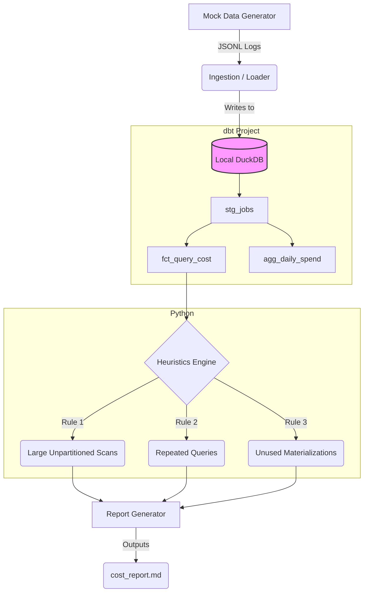

# Cloud Data Warehouse Cost-Optimization Pipeline

This repository contains a production-grade data engineering pipeline designed to ingest cloud data warehouse (BigQuery) execution logs, model the data using **dbt**, and apply a custom **Python heuristics engine** to automatically surface cost-saving recommendations with quantified dollar impacts.

## Problem Statement
Cloud data warehouses like BigQuery charge based on data scanned (compute) or storage used. Without tight governance, users and automated BI tools often run highly inefficient queries (e.g., `SELECT *` on massive unpartitioned tables, or repeating identical queries without caching). 

This pipeline acts as an automated "FinOps Data Engineer", scanning the warehouse's `INFORMATION_SCHEMA`, finding waste, and generating actionable reports that show exactly how much money can be saved by applying specific fixes (like clustering or incremental materialization).

## Architecture



## Tech Stack & Design Decisions
*   **Python 3.10+**: Core logic, ingestion, and reporting.
*   **dbt**: Data transformation. Chosen because modular, testable SQL is the industry standard for modeling.
*   **DuckDB**: Used as a local, serverless stand-in for BigQuery. This allows the entire pipeline to run locally and in CI/CD without incurring any cloud costs.
*   **Airflow**: Orchestration DAG provided to schedule the daily run.
*   **GitHub Actions**: CI pipeline enforcing linting (`ruff`), type checking (`mypy`), and testing (`pytest`, `dbt test`).

See `docs/postmortem.md` for a deeper dive into design trade-offs and debugging notes.

## How to Run Locally

### 1. Setup
```bash
make setup
```

### 2. Run the full pipeline
Generate mock data, ingest it, run dbt, and generate the report:

```bash
make generate-mock-data
make ingest-local
make dbt-run
make dbt-test
python -m src.report.generator
```

### 3. View the Results
Open `cost_report.md` to see the generated findings.

## Example Finding Output
The heuristic engine doesn't just flag bad queries; it simulates the financial impact of fixing them.

> **Job ID**: `bquxjob_9e1224ed_US` (User: analyst_junior@example.com)
> - **Cost**: $31.25
> - **Details**: Query scanned 5120.00 GB.
> - **Simulation**: *If this table were partitioned by date and the query filtered to a single day, the cost would drop to ~$0.09.*

## Repository Structure
*   `config/`: YAML configurations for business logic thresholds.
*   `dags/`: Airflow DAG definitions.
*   `dbt_project/`: SQL models and schema tests.
*   `src/`: Python source code (ingestion, heuristics, reporting).
*   `tests/`: Unit tests for Python components.
*   `.github/workflows/`: CI/CD definitions.
